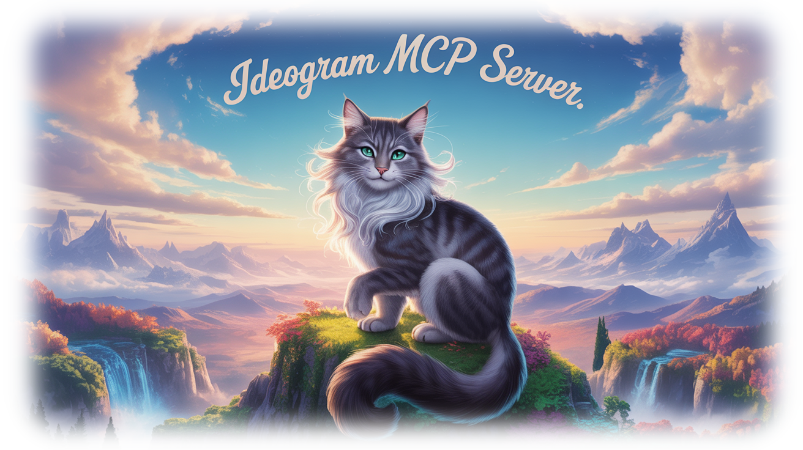

<p align="center">



# 🎨 Ideogram MCP Server

</p>

<p align="center">


</p>

<p align="center">
Ideogram APIを使用して画像生成機能を提供するModel Context Protocol (MCP) サーバー。<b>Ideogram 3.0</b> に対応！
</p>

https://github.com/user-attachments/assets/041553d3-6fbc-4dfa-b149-d195dcb9e8f8

## 📋 機能

- ✨ プロンプトに基づく画像生成
- 🔧 カスタマイズ可能なパラメータ
  - 📐 アスペクト比
  - 🚀 モデル選択（V1, V2, **V3**）
  - ✨ マジックプロンプト
  - 🎭 スタイルタイプ
  - 🚫 ネガティブプロンプト
  - 🔢 生成画像数
  - 🖼️ **スタイル参照機能**（Ideogram 3.0の新機能）
    - 🔗 URL参照画像（最大3枚）
    - 🎨 スタイルコード
    - 🎲 ランダムスタイル

## 🚀 セットアップ

1. 必要な依存関係をインストール:
```bash
npm install
```

2. 環境変数の設定:
`.env`ファイルを作成し、以下の内容を追加:
```env
IDEOGRAM_API_KEY=your_api_key_here
```

3. ビルド:
```bash
npm run build
```

4. （オプション）グローバルにインストール:
```bash
npm link
```

## ⚡️ クイックスタート

Claude Desktop や他の MCP クライアントで **最速** で Ideogram MCP Server を試すなら、  
以下の JSON スニペットを設定ファイルにコピペするだけで OK だよ！✨

> **npx で実行する場合**（推奨）  

```json
{
  "mcpServers": {
    "ideogram": {
      "command": "npx",
      "args": [
        "@sunwood-ai-labs/ideagram-mcp-server"
      ],
      "env": {
        "IDEOGRAM_API_KEY": "your_api_key_here"
      }
    }
  }
}
```
## 💻 使用方法

### MCPツール

#### generate_image

画像を生成するためのツール。

**必須パラメータ:**
- `prompt`: 画像生成に使用するプロンプト

**オプションパラメータ:**
- `aspect_ratio`: 画像のアスペクト比
  - `ASPECT_1_1`
  - `ASPECT_4_3`
  - `ASPECT_3_4`
  - `ASPECT_16_9`
  - `ASPECT_9_16`
- `model`: 使用するモデル
  - `V_1`
  - `V_1_TURBO`
  - `V_2`
  - `V_2_TURBO`
  - `V_3`
  - `V_3_TURBO`
  - `V_3_DEFAULT`
  - `V_3_QUALITY`
- `magic_prompt_option`: マジックプロンプトの設定
  - `AUTO`
  - `ON`
  - `OFF`
- `style_type`: 生成スタイル
- `negative_prompt`: 除外したい要素の説明
- `num_images`: 生成する画像の数（1-8）
- `style_reference`: スタイル参照オプション（Ideogram 3.0の新機能）
  - `urls`: 参照画像のURL配列（最大3つ）
  - `style_code`: スタイルコード
  - `random_style`: ランダムスタイルを使用するかどうか（boolean）

### 使用例

```typescript
// 基本的な使用例
const result = await use_mcp_tool({
  server_name: "ideagram-mcp-server",
  tool_name: "generate_image",
  arguments: {
    prompt: "A beautiful sunset over mountains",
    aspect_ratio: "ASPECT_16_9",
    model: "V_3_QUALITY", // Ideogram 3.0の最高品質モデル
    num_images: 1
  }
});

// スタイル参照機能を使用する例
const resultWithStyle = await use_mcp_tool({
  server_name: "ideagram-mcp-server",
  tool_name: "generate_image",
  arguments: {
    prompt: "A cat sitting on a window sill",
    aspect_ratio: "ASPECT_1_1",
    model: "V_3_DEFAULT",
    style_reference: {
      urls: [
        "https://example.com/reference_image1.jpg",
        "https://example.com/reference_image2.jpg"
      ]
    }
  }
});

// ランダムスタイルを使用する例
const resultWithRandomStyle = await use_mcp_tool({
  server_name: "ideagram-mcp-server",
  tool_name: "generate_image",
  arguments: {
    prompt: "A futuristic cityscape",
    model: "V_3_TURBO",
    style_reference: {
      random_style: true
    }
  }
});
```

## 🖥️ Claude Desktop での使用方法

Claude Desktopでideagram-mcp-serverを使用するための設定手順です。

### 📋 前提条件

- Claude Desktop がインストールされていること
- Node.js v16以上がインストールされていること
- Ideogram API キーを取得していること

### 🔧 セットアップ手順

1. **インストール**:
```bash
# グローバルにインストール
npm install -g @sunwood-ai-labs/ideagram-mcp-server

# または、プロジェクト内にインストール
npm install @sunwood-ai-labs/ideagram-mcp-server
```

2. **環境設定**:

プロジェクトのルートディレクトリに `.env` ファイルを作成し、以下の内容を追加:
```
IDEOGRAM_API_KEY=your_ideogram_api_key_here
```

3. **サーバー起動**:
```bash
# グローバルインストールした場合
ideagram-mcp-server

# ローカルインストールした場合
npx ideagram-mcp-server
```

4. **Claude Desktop の設定**:

Claude Desktopを開き、以下の手順で設定します:

- 設定メニュー（⚙️）を開く
- 「外部ツール」または「拡張機能」セクションに移動
- 「MCPツールを追加」をクリック
- 以下の情報を入力:
  - **名前**: Ideogram MCP
  - **エンドポイント**: http://localhost:8080
  - **説明**: Ideogram APIを使用した画像生成ツール

**JSON設定ファイルを使用する方法**:

Claude Desktopでは、JSON設定ファイルを使って直接MCPサーバーを設定することもできます。以下の手順に従ってください:

1. Claude Desktopの設定ファイルを開く/作成する:
   - **Windows**: `%AppData%\Claude\claude_desktop_config.json`
   - **macOS**: `~/Library/Application Support/Claude/claude_desktop_config.json`
   - **Linux**: `~/.config/Claude/claude_desktop_config.json`

2. 以下のJSON設定を追加/編集する:
```json
{
  "mcpServers": {
    "ideogram": {
      "command": "node",
      "args": [
        "/path/to/ideagram-mcp-server/build/index.js"
      ],
      "env": {
        "IDEOGRAM_API_KEY": "your_api_key_here"
      }
    }
  }
}
```

設定例:

- **npxで実行する場合**(推奨):
```json
{
  "mcpServers": {
    "ideogram": {
      "command": "npx",
      "args": [
        "@sunwood-ai-labs/ideagram-mcp-server"
      ],
      "env": {
        "IDEOGRAM_API_KEY": "your_api_key_here"
      }
    }
  }
}
```

- **特定のバージョンを指定する場合**:
```json
{
  "mcpServers": {
    "ideogram": {
      "command": "npx",
      "args": [
        "@sunwood-ai-labs/ideagram-mcp-server@0.2.1"
      ],
      "env": {
        "IDEOGRAM_API_KEY": "your_api_key_here"
      }
    }
  }
}
```

- **ローカルファイルを直接実行する場合**:
  - **Mac/Linux**の場合:
  ```json
  {
    "mcpServers": {
      "ideogram": {
        "command": "node",
        "args": [
          "/Users/username/ideagram-mcp-server/build/index.js"
        ],
        "env": {
          "IDEOGRAM_API_KEY": "your_api_key_here"
        }
      }
    }
  }
  ```

  - **Windows**の場合:
  ```json
  {
    "mcpServers": {
      "ideogram": {
        "command": "node",
        "args": [
          "C:\\Users\\username\\ideagram-mcp-server\\build\\index.js"
        ],
        "env": {
          "IDEOGRAM_API_KEY": "your_api_key_here"
        }
      }
    }
  }
  ```

> **注意**: `/path/to/` や `username` の部分は実際のパスやユーザー名に置き換えてください。APIキーは直接環境変数として設定することもできますが、パス上に `.env` ファイルを配置することも可能です。

5. **動作確認**:

Claude Desktopのチャットで以下のようにツールを呼び出すことができます:
```
@Ideogram MCP generate_image
プロンプト: 美しい山の夕焼け
アスペクト比: ASPECT_16_9
モデル: V_3_QUALITY
```

### 🔍 トラブルシューティング

- **接続エラーが発生する場合**: サーバーが正しく起動しているか確認してください
- **APIキーエラー**: `.env` ファイルが正しい場所にあり、有効なAPIキーが設定されていることを確認してください
- **ポート競合**: デフォルトポート（8080）が他のアプリケーションと競合している場合は、起動時にポートを指定できます: `ideagram-mcp-server --port 8081`

## 🔧 開発

### ディレクトリ構造

```
ideagram-mcp-server/
├── src/
│   ├── index.ts          # メインのサーバーコード
│   └── ideogram-client.ts # Ideogram APIクライアント
├── package.json
├── tsconfig.json
└── README.md
```

### スクリプト

- `npm run build`: TypeScriptのコンパイル
- `npm run watch`: 開発モードでの実行（ファイル変更の監視）
- `npm run lint`: コードのリント
- `npm test`: テストの実行

## 📄 ライセンス

MIT

## 🤝 コントリビューション

1. このリポジトリをフォーク
2. 新しいブランチを作成 (`git checkout -b feature/amazing-feature`)
3. 変更をコミット (`git commit -m '✨ feat: Add amazing feature'`)
4. ブランチにプッシュ (`git push origin feature/amazing-feature`)
5. プルリクエストを作成

## 🚀 デプロイ

このパッケージはGitHub Actionsを使用して自動的にnpmに公開されます。

### 新バージョンの公開方法

#### タグを使用して公開

1. パッケージのバージョンを更新：
   ```bash
   npm version patch  # パッチバージョンを上げる
   # または
   npm version minor  # マイナーバージョンを上げる
   # または
   npm version major  # メジャーバージョンを上げる
   ```

2. タグをプッシュ：
   ```bash
   git push --follow-tags
   ```

これにより、GitHub Actionsが自動的に新しいバージョンをnpmに公開します。

### 詳細情報

デプロイの詳細な手順や設定については [デプロイドキュメント](./docs/npm-deploy.md) を参照してください。


